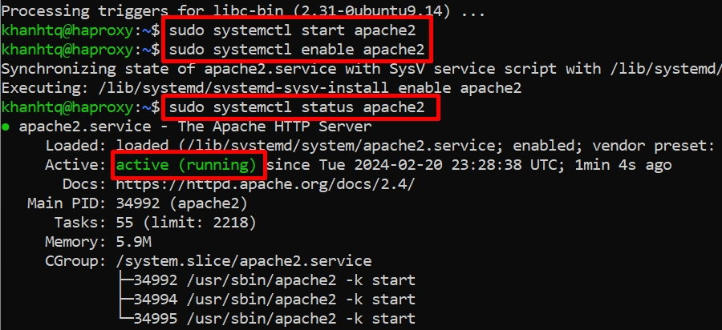
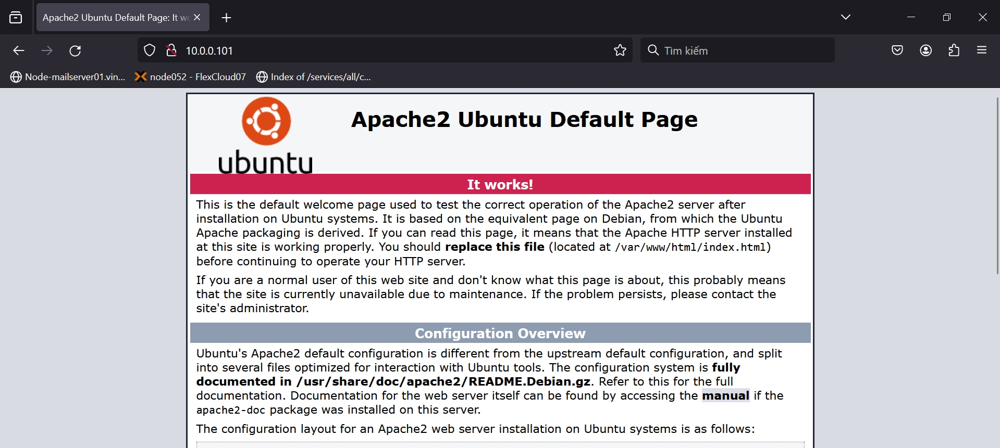
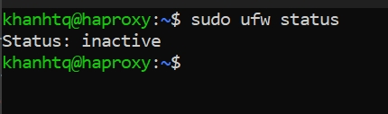
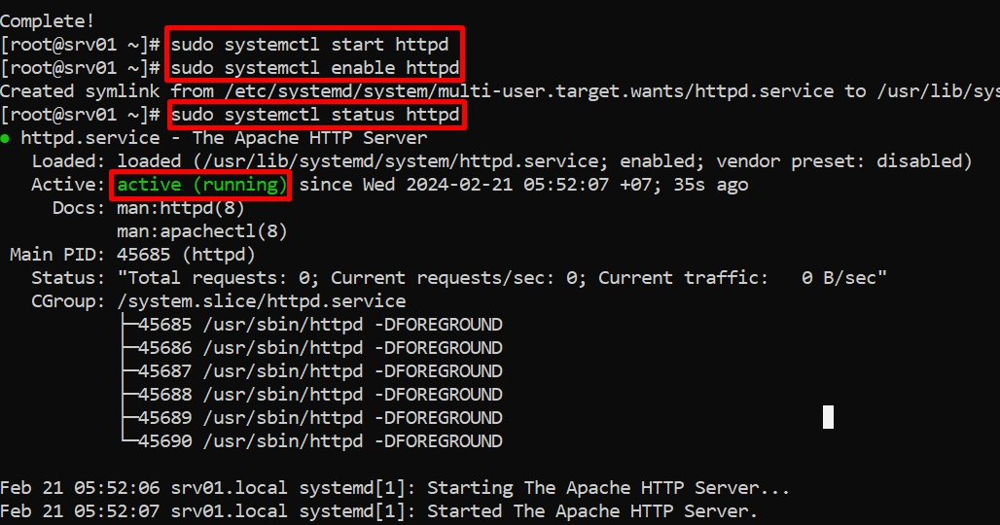
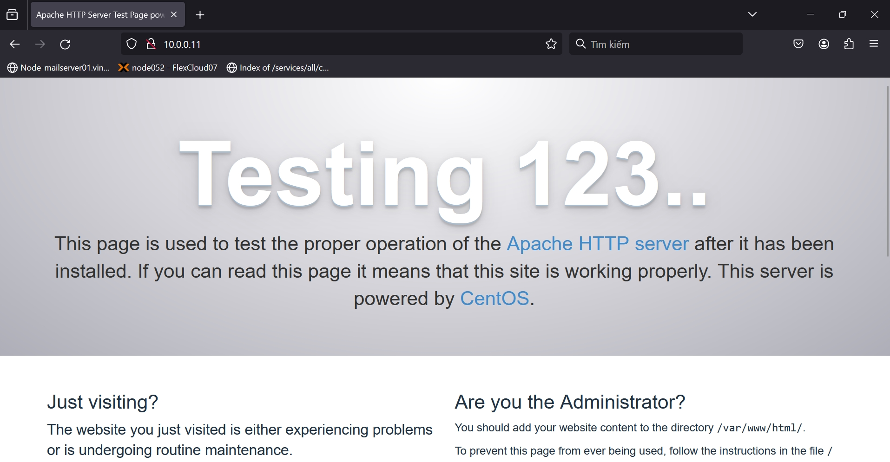
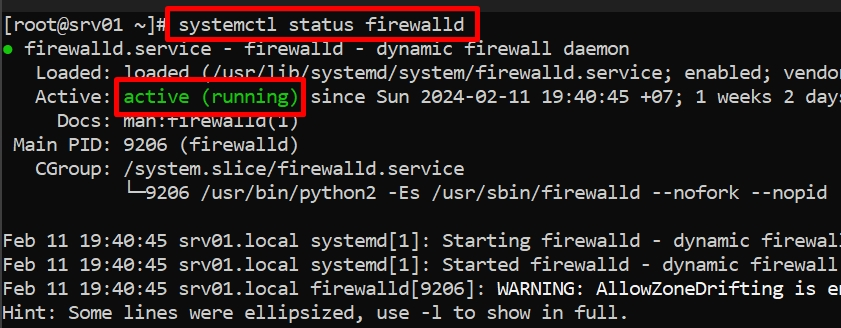
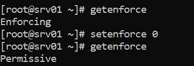

# Cài đặt Apache trên Linux

Mở Terminal trực tiếp trên Linux nếu có giao diện người dùng hoặc SSH nếu chỉ có giao diện dòng lệnh để tiến hành cài đặt Apache.

## Ubuntu

*Bài viết này hướng dẫn cài đặt Apache trên **Ubuntu 20.04 LTS***.

Cập nhật các gói trong Ubuntu

```
sudo apt update -y && sudo apt upgrade -y
```

Cài đặt Apache sau khi quá trình cập nhật hoàn tất

```
sudo apt install apache2
```

Sau khi cài đặt thành công, chạy Apache và cho phép nó khởi động cùng hệ thống

```
sudo systemctl start apache2
sudo systemctl enable apache2
```

Kiểm tra trạng thái của Apache, nếu ***active*** nghĩa là đã khởi chạy thành công

```
sudo systemctl status apache2
```



Mở trình duyệt và truy cập **http://[địa_chỉ_IP]**. Thay **[địa_chỉ_IP]** bằng địa chỉ IP thật của host. Trang mặc định của Apache sẽ hiện lên.



Trong trường hợp không thể truy cập URL trên, thực hiện:
- Kiểm tra tường lửa. Tường lửa mặc định của Ubuntu 20.04 LTS là `ufw`, chế độ mặc định là ***inactive*** (tắt)

```
sudo ufw status
```



- Thực hiện cho phép các kết nối đến cổng 80, 443 (2 cổng mặc định của dịch vụ web) nếu tường lửa đang hoạt động

```
sudo ufw allow in "Apache Full"
```

## CentOS

*Bài viết này hướng dẫn cài đặt Apache trên **CentOS 7***.

Cập nhật và nâng cấp các gói trong CentOS

```
sudo yum update -y && sudo yum upgrade -y
```

Cài đặt Apache sau khi quá trình cập nhật hoàn tất

```
sudo yum install httpd
```

Sau khi cài đặt thành công, chạy Apache và cho phép nó khởi động cùng hệ thống

```
sudo systemctl start httpd
sudo systemctl enable httpd
```

Kiểm tra trạng thái của Apache, nếu ***active*** nghĩa là đã khởi chạy thành công

```
sudo systemctl status httpd
```



Mở trình duyệt và truy cập **http://[địa_chỉ_IP]**. Thay **[địa_chỉ_IP]** bằng địa chỉ IP thật của host. Trang mặc định của Apache sẽ hiện lên.



Trong trường hợp không thể truy cập URL trên, thực hiện:
- Kiểm tra tường lửa. Tường lửa mặc định của CentOS 7 là `firewalld`

```
sudo systemctl status firewalld
```



- Thực hiện cho phép các kết nối đến cổng 80, 443 (2 cổng mặc định của dịch vụ web) nếu tường lửa đang hoạt động

```
sudo firewall-cmd --zone=public --add-port=80/tcp --permanent
sudo firewall-cmd --zone=public --add-port=443/tcp --permanent
sudo firewall-cmd --reload
```

- Truy cập lại **http://[địa_chỉ_IP]** một lần nữa trên trình duyệt. Nếu vẫn không thể truy cập, kiểm tra **SELinux** và tắt nó đi nếu nó đang có trạng thái ***Enforcing*** 

```
getenforce
setenforce 0
```



Chúc bạn thực hiện thành công!