# Cài đặt Apache trên Window với XAMPP

## Cài đặt
XAMPP là một bộ công cụ phần mềm mã nguồn mở được thiết kế để tạo ra một môi trường phát triển web đơn giản và dễ cài đặt trên máy tính cá nhân.
- X - Linux, Windows, Mac OS X
- A - Apache
- M - MySQL
- P - PHP
- P - Perl

Truy cập https://www.apachefriends.org/download.html để tải gói cài đặt XAMPP cho Windows.

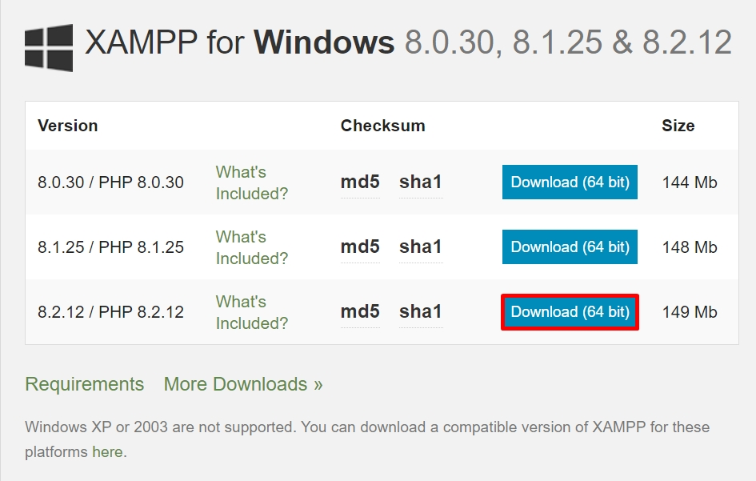

Sau khi tải xong, nhấn đúp chuột vào tệp vừa tải để cài đặt XAMPP.

Sẽ có một hộp thoại cảnh báo hiện lên.

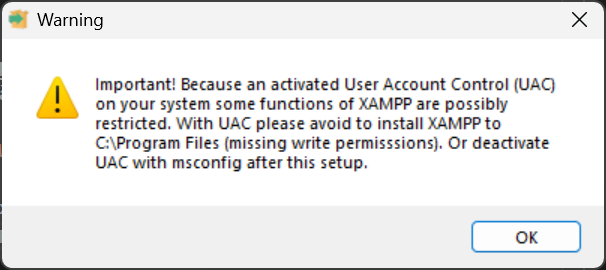

Nội dung của cảnh báo là "tránh cài đặt XAMPP trong thư mục `C:\Program Files`" vì như vậy sẽ hạn chế quyền ghi dữ liệu của nó. Vì vậy, chúng ta sẽ cài đặt nó tại thư mục `C:\xampp`. Bấm **OK** để bỏ qua cảnh báo.

Chọn **Next** ở bước tiếp theo.

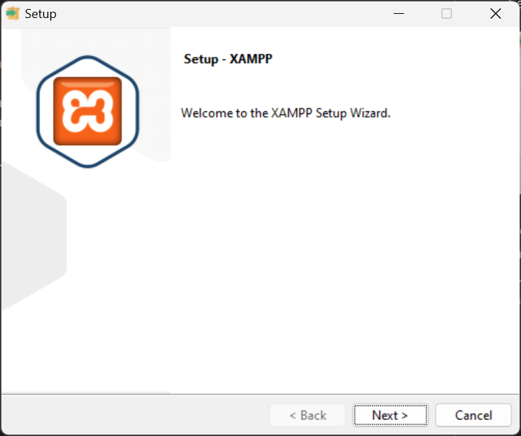

Tích vào các tuỳ chọn để cài đặt theo mong muốn. Mặc định, Apache và PHP là 2 lựa chọn bắt buộc. Sau đó, chọn **Next**.

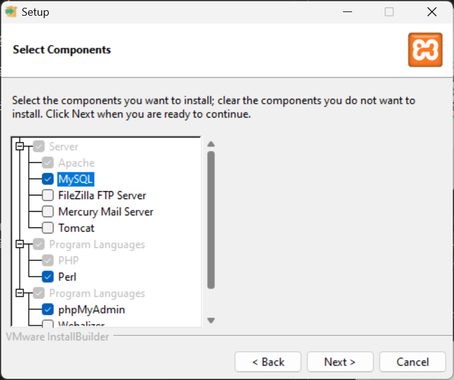

Chọn **Next** ở bước tiếp theo. XAMPP sẽ được cài đặt tại thư mục `C:\xampp`.

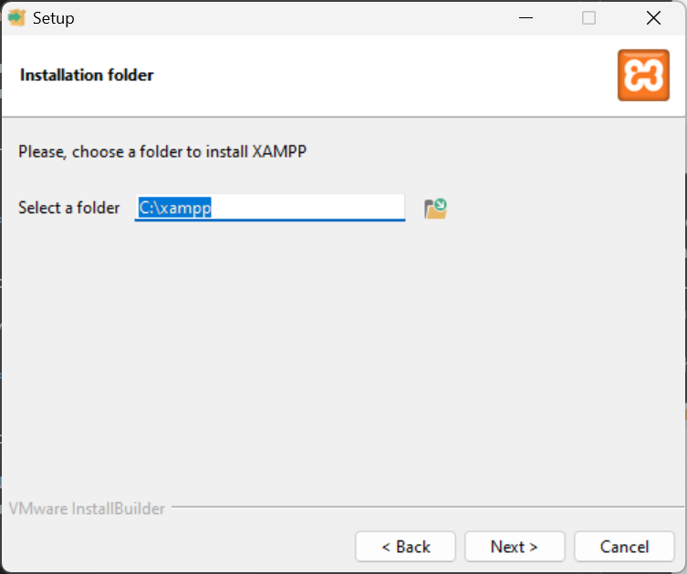

Chọn ngôn ngữ rồi nhấn **Next**.

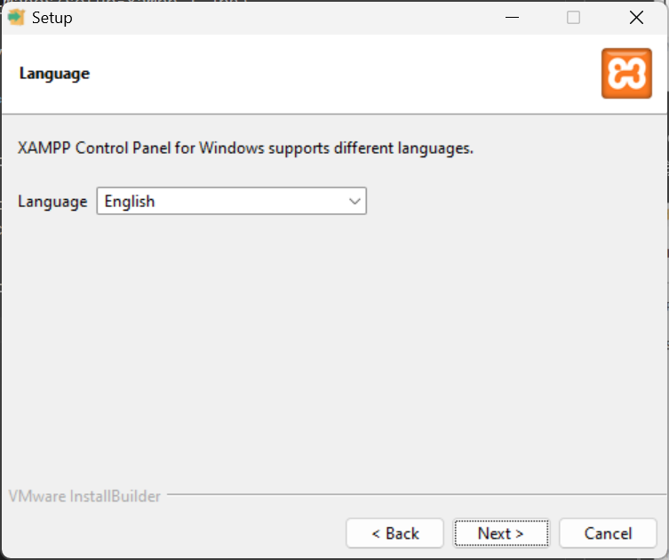

Chọn **Next** để cài đặt.

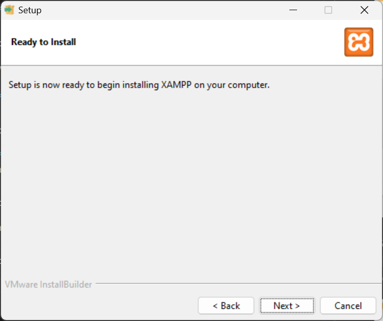

XAMPP đang được cài đặt. Quá trình này sẽ mất vài phút để hoàn tất.

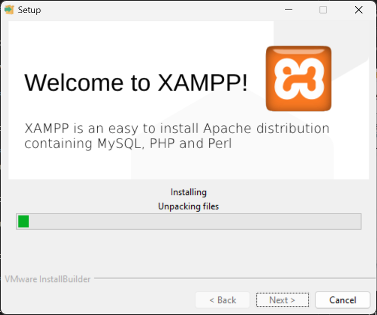

Chọn **Allow** để cho phép mạng công cộng và riêng tư kết nối đến Apache.

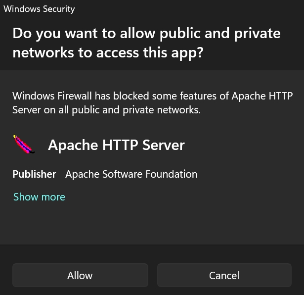

Tích vào ô "*Do you want to...*" để mở Control Panel. Nhấn **Finish** để kết thúc cài đặt.

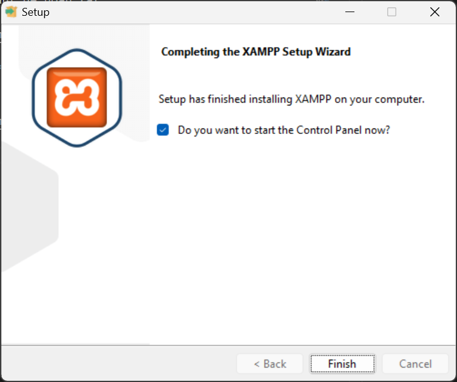

Control Panel của XAMPP hiện lên.

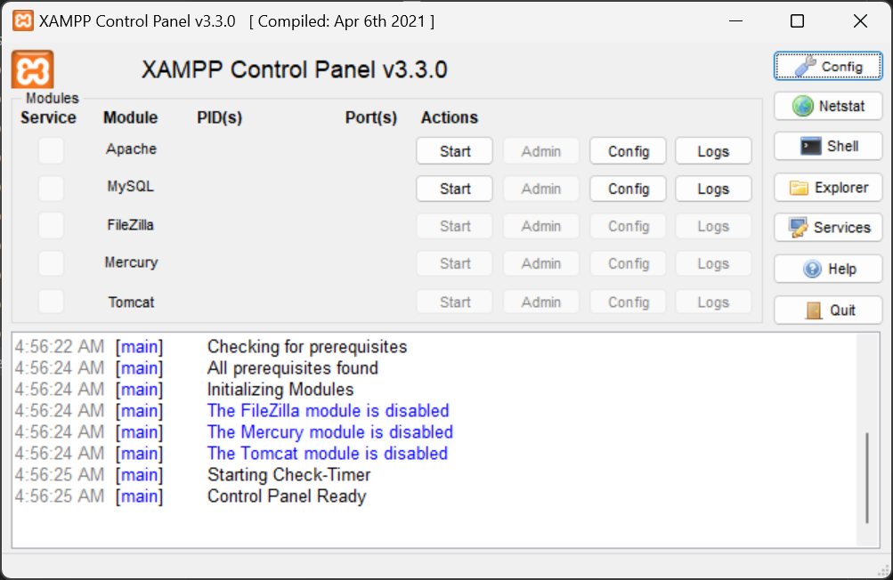

Như vậy là XAMPP đã được cài đặt thành công.

Trên giao diện XAMPP Control Panel, tại mục **Actions** của Apache, chọn **Start** để chạy máy chủ web Apache.

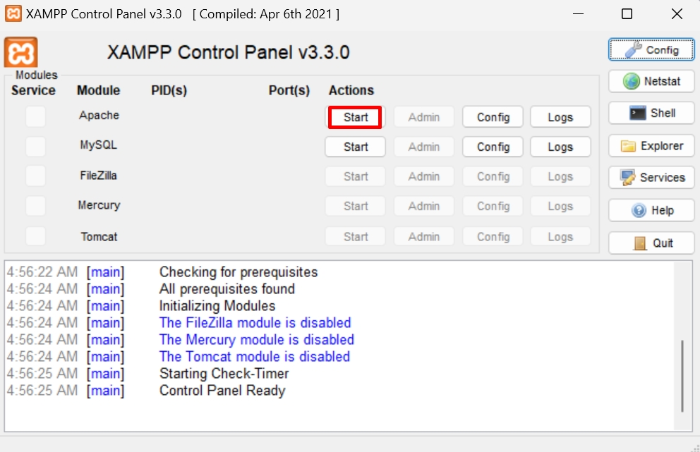

Apache đang chạy sẽ có **PID(s)** và các **Port(s)**.

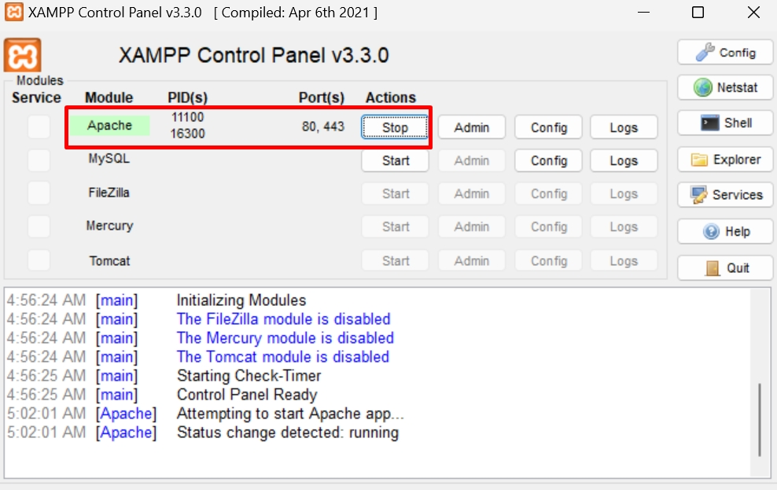

Truy cập http://localhost trên trình duyệt sẽ hiển thị trang mặc định như sau.

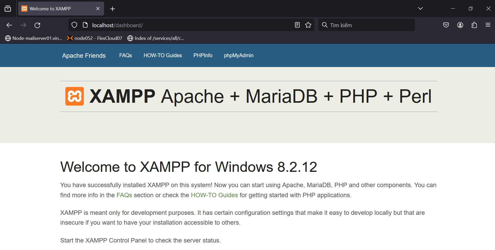

## Cách sử dụng XAMPP Control Panel với Apache

### Cấu hình

Trên giao diện XAMPP Control Panel, tại mục **Actions** của Apache, chọn:
- **Config > Apache (httpd.conf)** để cấu hình với HTTP,
- **Config > Apache (httpd-ssl.conf)** để cấu hình với HTTPS,
- **Browse Apache** để mở thư mục của Apache.

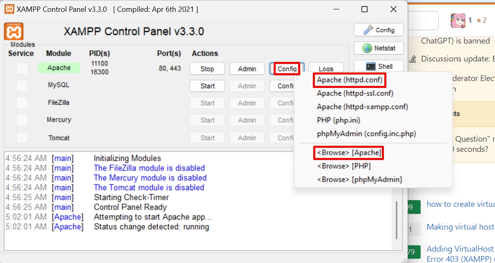

Vì chúng ta chưa có SSL nên sẽ chọn **Config > Apache (httpd.conf)** để cấu hình với HTTP. Tệp cấu hình sẽ được mở lên bằng trình soạn thảo mặc định của Windows. Cuối cùng là chỉnh sửa tệp cấu hình theo mong muốn.

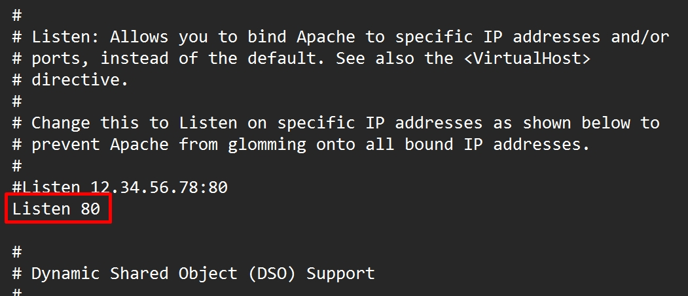

### Quản trị dịch vụ

Trên giao diện XAMPP Control Panel, tại mục **Actions** của Apache, chọn:
- **Stop** để dừng dịch vụ Apache.
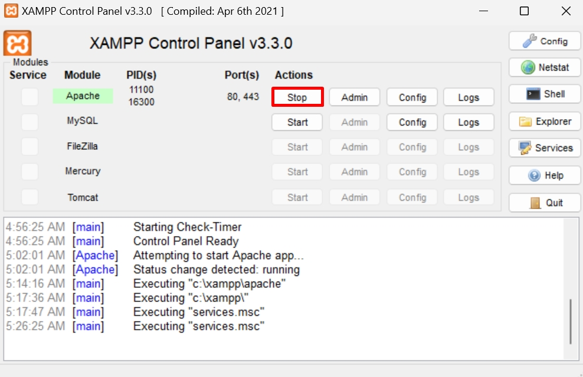
- **Logs** để xem các log của Apache và PHP
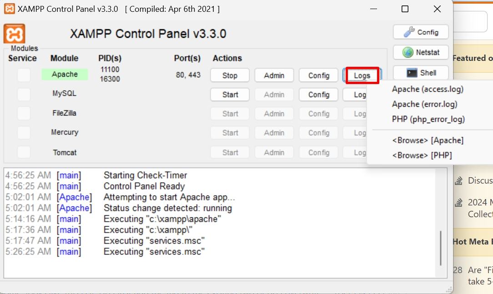
